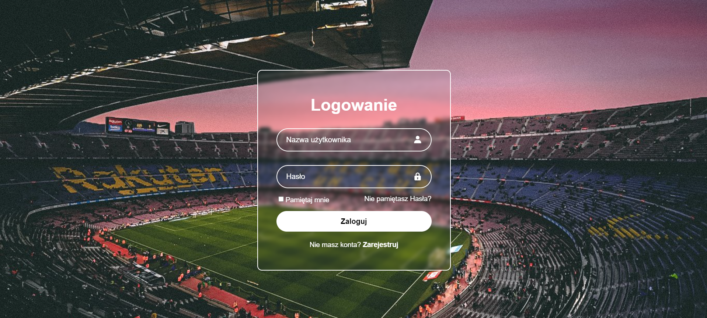
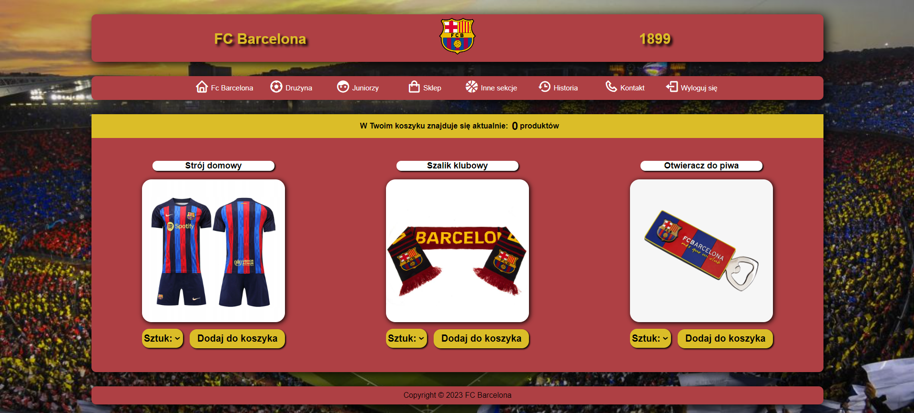
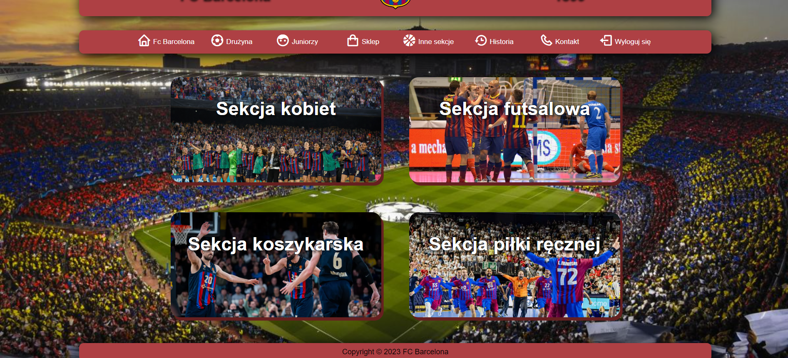
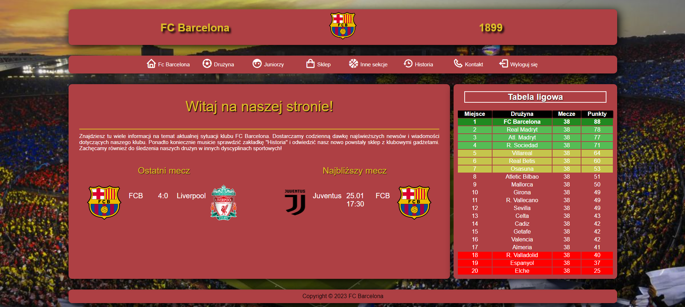

# Frontend project made as part of the course Internet techniques.

### 
This website was built using the following technologies:

- HTML
- CSS
- JavaScript
#

To explore our website, simply visit [this page](https://github.com/filiphalys02/Football-Club-Page/blob/main/Main/login.html). You can find there log-in page. To log in user have to enter username and password: 

  
#
Logged in user can explore our website by clicking on the appropriate bookmark.  
Below we present some of them:
 
  
 